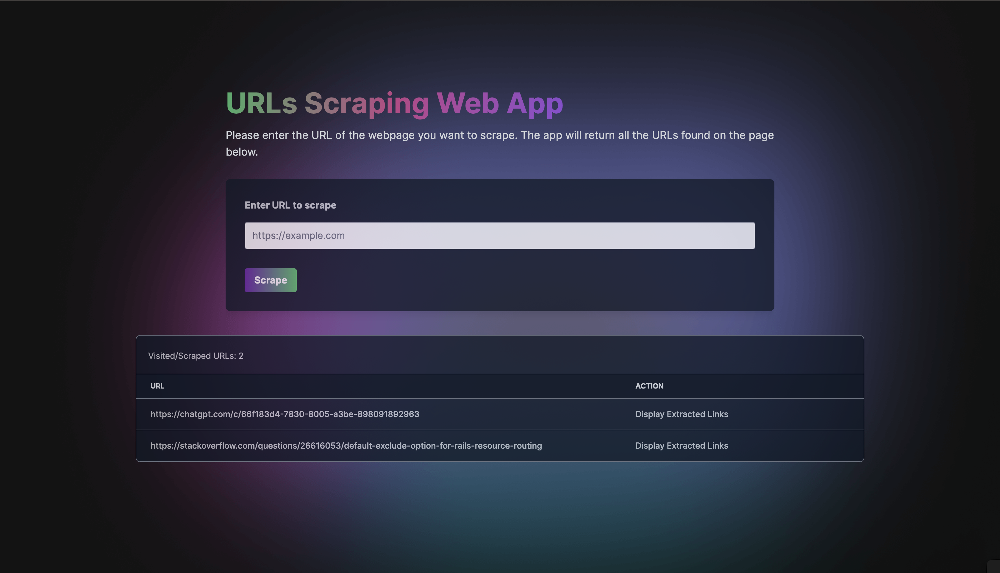

# Link Scraper Web Application

To scrape URLs from web pages using a Rails backend, paired with a Vue.js single-page application.

---

## Overview

- This application allows users to input a URL and scrape all the URLs from the page. The scraped URLs are displayed in a table format, showing both the URL and its associated anchor text.
- Additionally, users can view previously scraped URLs from visited pages as shown in the screenshot below.




---

## System Dependencies
- **Ruby**: `3.1.4`
- **Rails**: `7.1.4`
- **Vue.js**: `3.3.13`
---

## Tech Stack
- **Backend**: Ruby on Rails
- **Frontend**: Vue.js
- **CSS Framework**: Tailwind CSS

---
## Setup Instructions

1. Clone the project from GitHub:
```bash
git clone https://github.com/hmzasif/scraping_urls.git
```

2. Install dependencies using:
```bash
bundle
```

3. If you face further error, please run this command too:
```bash
yarn install
```

4. To setup the database, please run:
```bash
rails db:create db:migrate
```
5. To seed the development database, run:
```bash
rails db:seed
```

6. Run the local server:
```bash
bin/dev
```

##  Models Relationships

> `SourceURL` can have many `ScrapedURLs`, forming a one-to-many relationship.
>
> `SourceUrl` store the URL of the page to be scraped with `url` field and `ScrapedUrl` store the URLs scraped from the page with `url` and `anchor_text` fields.


## Managing Secrets in Rails 7

In Rails 7, secrets are securely managed using the credentials file. Follow these steps to handle your application secrets:

1. **Generate a Secret Key:**
   Run the following command to create a new secret key:
```bash
rails secret
```
2. **Update credentials:** You can use any text editor of your choice to update the credentials file, such as `nano`, `vim`, or `code`. For example, with code, run the following command:
```bash
EDITOR=code rails credentials:edit --environment development
```

Inside the credentials file, add your secrets. since SQLite is being used, no passwords are required.

## Deployment

The application is deployed on Render. You can access the live version [here](https://example.com/).
